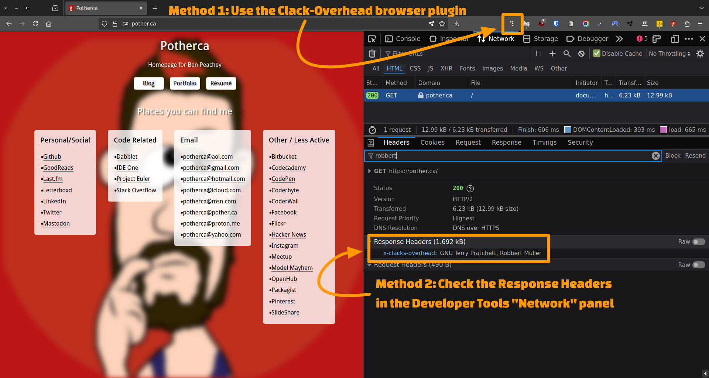

# How to verify Clacks Overhead

There are several ways to verify that Clacks Overhead headers have been set, either using a web browser or command line tools.

## Using a web browser

In the browser, there two methods to verify the presence of the `X-Clacks-Overhead` header:

1. Using a browser plugin
2. Using the browser's Developer Tools



### Using a browser plugin

There are browser plugins available for both Firefox and Chrome that can help you verify the presence of the `X-Clacks-Overhead` header.

- Firefox: [X-Clacks-Overhead](https://addons.mozilla.org/en-US/firefox/addon/x-clacks-overhead/)
- Chrome: [Clacks Overhead - GNU Terry](https://chromewebstore.google.com/detail/clacks-overhead-gnu-terry/lnndfmobdoobjfcalkmfojmanbeoegab)

1. Install the plugin
2. Visit a page
3. Look at the plugin icon

|                   | Chrome                          | Firefox                          |
|-------------------|---------------------------------|----------------------------------|
| Clacks active     |    |    |
| Clacks not active |  |  |

### Using the browser's Developer Tools

1. Visit a page
2. Open the developer tools
3. Visit the "Network" tab
4. Reload the page
5. Click on the first request in the list
6. Select the "Headers" tab if it isn't already selected
7. Look in the "Response Headers" section

If the page contains Clacks Overhead headers, you should see a header named `X-Clacks-Overhead` with the value `GNU Robbert Muller`.

## Using a command line tool

There are various tools that can be used to check for the presence of the `X-Clacks-Overhead` header in the HTTP response.

After opening a terminal or command prompt, run an appropriate command based on the tool you prefer:

Replacing `https://example.com` in the examples below  with the URL of the page to check).

If the header is present, you should see output similar to:

```sh
x-clacks-overhead: GNU Robbert Muller
```

If the header is not present, there will be no output.

### Using `curl`

 ```bash
 curl --head --silent https://example.com | grep --ignore-case clacks
 ```

### Using `wget`

```sh
wget --quiet --server-response --spider  https://example.com 2>&1 | grep --ignore-case clacks
```
