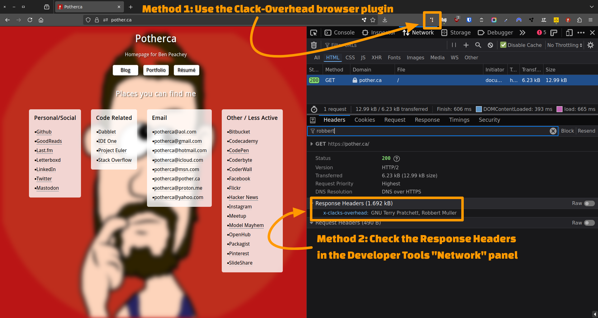

# How to verify the Clacks Overhead header

There are two ways to verify that Clacks Overhead headers have been set:

1. Using a browser plugin
2. Using the browser's Developer Tools

##  Using a browser plugin

There are browser plugins available for both Firefox and Chrome that can help you verify the presence of the `X-Clacks-Overhead` header.

- https://chromewebstore.google.com/detail/clacks-overhead-gnu-terry/lnndfmobdoobjfcalkmfojmanbeoegab
- https://addons.mozilla.org/en-US/firefox/addon/x-clacks-overhead/

1. Install the plugin
2. Visit a page
3. Look at the plugin icon

|                   | Chrome                          | Firefox                          |
|-------------------|---------------------------------|----------------------------------|
| Clacks active     |    |    |
| Clacks not active |  |  |

## Using the browser's Developer Tools

1. Visit a page
2. Open the developer tools
3. Visit the "Network" tab
4. Reload the page
5. Click on the first request in the list
6. Select the "Headers" tab if it isn't already selected
7. Look in the "Response Headers" section

If the page contains Clacks Overhead headers, you should see a header named `X-Clacks-Overhead` with the value `GNU Robbert Muller`.
